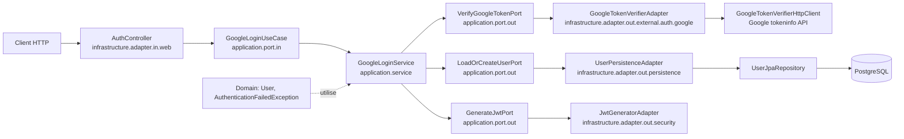
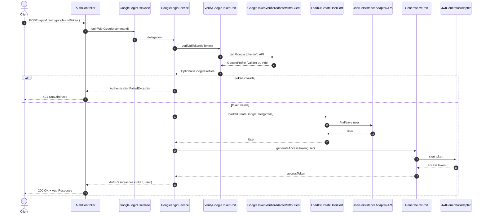

# Google Auth - Schema Hexagonal

Ce document montre le flux d'authentification Google dans l'architecture hexagonale du projet.

## 1) Schema de dependances

## 2) Schema de sequence

## 3) Mapping rapide des couches

- Domain: modeles et regles metier pures (`User`, exceptions metier).
- Application: use cases et ports (`GoogleLoginUseCase`, `...Port`).
- Infrastructure IN: entree HTTP (`AuthController`, DTO web, mapper web).
- Infrastructure OUT: Google API, persistence JPA, generation token.
- Configuration: wiring Spring (`AuthenticationBeanConfig`, properties).

